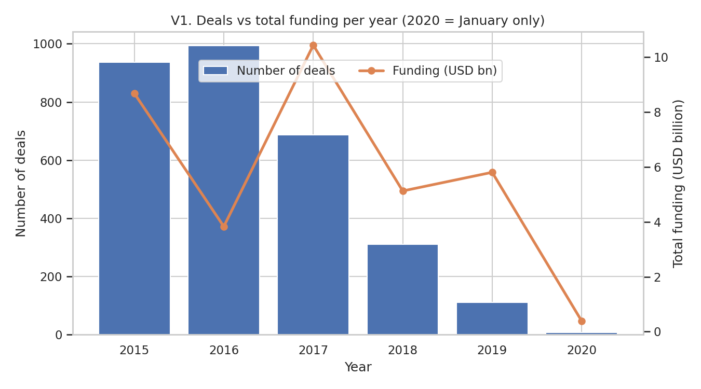
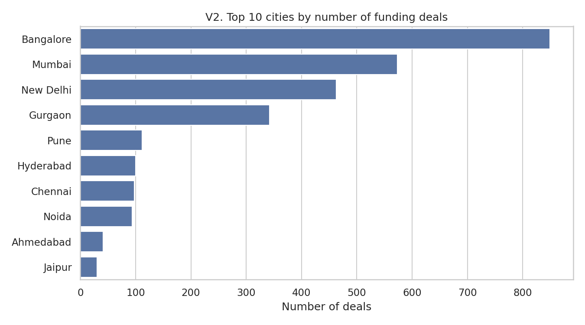
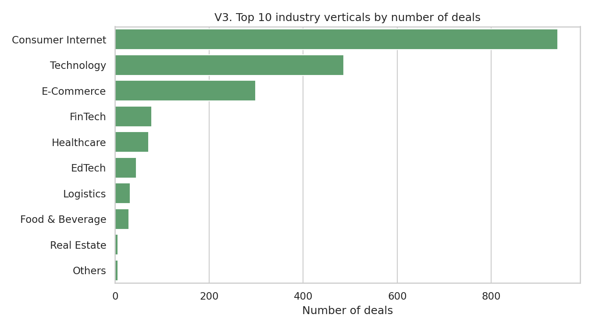
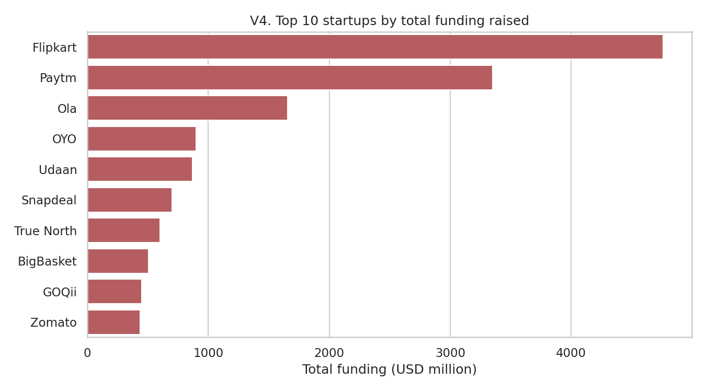
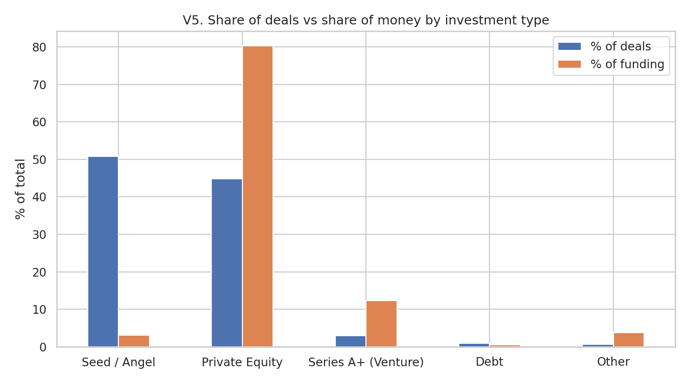
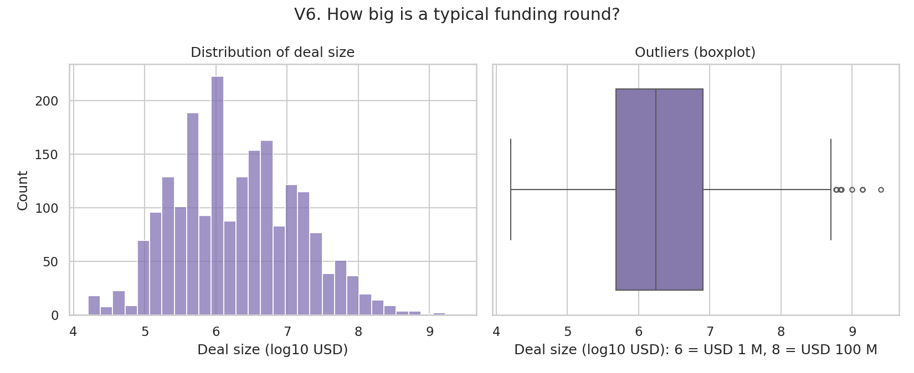
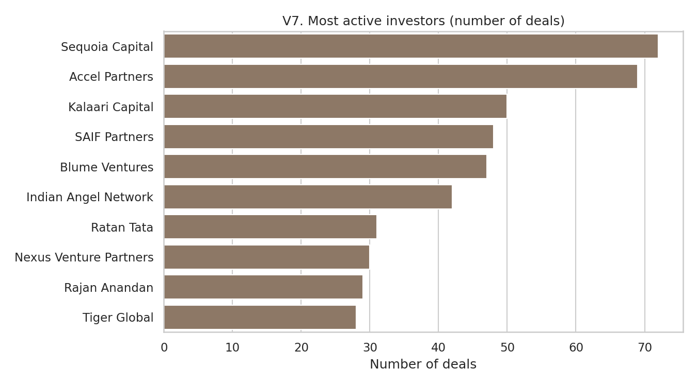
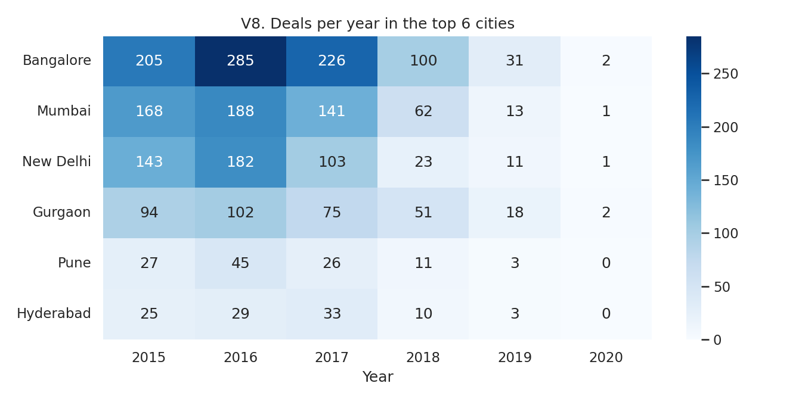

# Indian Startup Funding Analysis

Data cleaning and exploratory analysis of 3,044 Indian startup funding deals (Jan 2015 – Jan 2020) using Python.

**Dataset:** [Indian Startup Funding – Kaggle](https://www.kaggle.com/datasets/sudalairajkumar/indian-startup-funding)

## Project structure
```
indian-startup-funding-analysis/
├── startup_funding.csv          # raw data from Kaggle
├── startup_funding_clean.csv    # output of analysis.py
├── v1_yearly_trend.png ... v8_city_year_heatmap.png   # 8 charts
├── analysis.py                  # cleaning + visualizations
├── requirements.txt
└── README.md
```

## How to run
```bash
pip install -r requirements.txt
python analysis.py
```

## Cleaning steps
1. Renamed columns (fixed typos like `InvestmentnType`)
2. Removed junk characters (`\xc2\xa0`, `\n`)
3. Fixed 8 date typos and converted dates to datetime
4. Converted `Amount in USD` from text to float ("undisclosed" → NaN)
5. Standardised city, industry, startup and investment-type names
6. Missing values: dropped `Remarks` (86% empty), filled text with "Unknown", flagged undisclosed amounts
7. Duplicates checked and removed (0 found)
8. Outliers flagged with IQR on log10(amount); one data-entry error fixed

## Visualizations
| # | Chart | Question |
|---|---|---|
| V1 | Deals vs funding per year | How did funding change over time? |
| V2 | Top 10 cities | Where are the startup hubs? |
| V3 | Top 10 industries | Which sectors get funded? |
| V4 | Top 10 startups by funding | Who raised the most? |
| V5 | Deals vs money by investment type | Seed vs private equity |
| V6 | Deal-size histogram + boxplot | Typical deal size and outliers |
| V7 | Most active investors | Who invests most often? |
| V8 | City × year heatmap | How did each hub change? |

## Charts









## Key insights
- Deals fell from 993 (2016) to 111 (2019) while money stayed high: fewer, bigger rounds.
- Bangalore, Mumbai, New Delhi and Gurgaon hold 78% of deals; Bangalore took 43% of all money.
- Consumer Internet, Technology and E-Commerce make up 57% of deals.
- Seed/angel = 51% of deals but 3% of money; private equity = 80% of money.
- Median deal USD 1.75 M vs mean USD 16.5 M.

## Team
- Shlok – <role>
- <Teammate> – <role>
